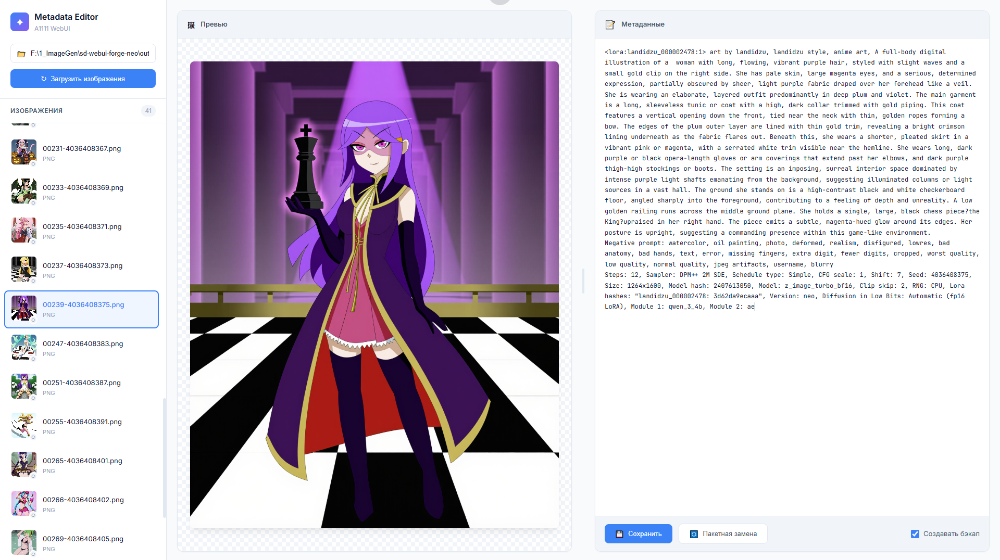

# A1111 Metadata Editor

<p align="center">
  
</p>

<p align="center">
  <strong>Web-based metadata editor for Stable Diffusion images</strong><br>
  Edit prompts and generation parameters directly in PNG/JPG files created by Automatic1111 WebUI
</p>

<p align="center">
  <em>🛡️ Perfect for cleaning up prompts before uploading to Civitai — bypass overzealous AI content filters by removing or replacing flagged words in metadata</em>
</p>

<p align="center">
  <a href="#features">Features</a> •
  <a href="#installation">Installation</a> •
  <a href="#usage">Usage</a> •
  <a href="#documentation">Documentation</a> •
  <a href="#license">License</a>
</p>

---

## Features

- 🖼️ **Visual Browser** — Browse images with thumbnails, see previews instantly
- 📝 **Metadata Editor** — Edit prompts, negative prompts, and all generation parameters
- 🔄 **Batch Replace** — Find and replace text across all images in a folder
- 🛡️ **Civitai Ready** — Clean up prompts before upload, replace flagged words to pass AI moderation
- 💾 **Safe Editing** — Optional automatic backups before any changes
- 📊 **Status Indicators** — See which files are original, modified, or saved
- 🎨 **Modern UI** — Clean, responsive interface with resizable panels
- 📁 **PNG & JPG Support** — Works with both `tEXt` and `iTXt` PNG chunks

## Installation

### Requirements

- Python 3.7+
- Flask

### Quick Start

```bash
# Clone the repository
git clone https://github.com/yourusername/a1111-metadata-editor.git
cd a1111-metadata-editor

# Install dependencies
pip install flask

# Run the application
python metadata_editor.py
```

Open http://localhost:5000 in your browser.

## Usage

### Basic Workflow

1. Enter the path to your image folder
2. Click "Загрузить изображения" (Load Images)
3. Select an image from the list
4. Edit metadata in the text area
5. Click "Сохранить" (Save)

### Status Indicators

| Icon | Status | Description |
|------|--------|-------------|
| ○ | Pristine | Original file, never edited |
| ✓ | Saved | Has been edited (backup exists) |
| ● | Modified | Changed but not yet saved |

### Batch Replace

1. Load a folder with images
2. Click "Пакетная замена" (Batch Replace)
3. Enter search text and replacement
4. Click "Заменить во всех" (Replace All)

### Keyboard Shortcuts

- `Enter` in folder input — Load folder
- `Enter` in search field — Execute batch replace
- `Escape` — Close modal

## Supported Formats

### PNG Files
- `tEXt` chunks with `parameters` keyword
- `iTXt` chunks with `parameters` keyword (UTF-8, compressed/uncompressed)

### JPG Files
- EXIF UserComment field (UTF-16BE encoded)

## Screenshots

<details>
<summary>Click to expand</summary>

### Main Interface


### Batch Replace


</details>

## Documentation

See [docs/](docs/) folder for detailed documentation:

- [API Reference](docs/API.md)
- [Technical Details](docs/TECHNICAL.md)

## Contributing

Contributions are welcome! Please feel free to submit a Pull Request.

## License

MIT License — see [LICENSE](LICENSE) for details.

## Acknowledgments

- Built for use with [Automatic1111 WebUI](https://github.com/AUTOMATIC1111/stable-diffusion-webui)
- Inspired by the need to batch-edit generation parameters

---

<p align="center">
  Made with ❤️ for the Stable Diffusion community
</p>

